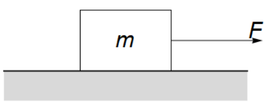
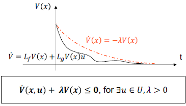
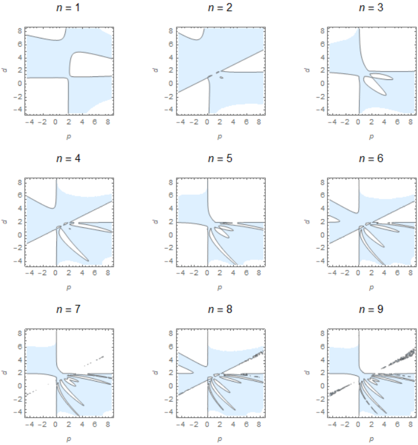
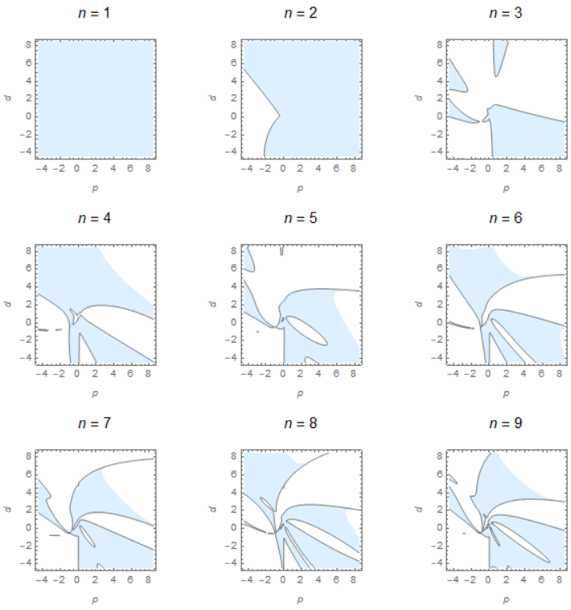

# 基于control Lyapunov function理论的数字采样反馈控制系统稳定性问题研究

## 1. 连续系统离散化

对于如下线性系统：

$$
\dot{\vec{\theta}} = \mathcal{A} \vec{\theta} + \mathcal{B} \left. \vec{\theta} \right |_{t=(n-1)\tau},\qquad t\in[n\tau, (n+1)\tau),n \in \mathbb{N},
$$

可求解常微分方程得到：

$$
\begin{aligned}
    \left. \vec{\theta} \right |_{t=(n+1)\tau} &= \exp{(\mathcal{A} \tau)} \left. \vec{\theta} \right |_{t=n\tau} + \int_{0}^{\tau} \exp{(\mathcal{A} t_0)} dt_0 \mathcal{B} \left. \vec{\theta} \right |_{t=n\tau} \\
    &= \Bigg (\exp{(\mathcal{A} \tau)} + \bigg (\int_{0}^{\tau} \exp{(\mathcal{A} t_0)} dt_0 \bigg) \mathcal{B} \Bigg) \left. \vec{\theta} \right |_{t=n\tau} \\
    &= A \left. \vec{\theta} \right |_{t=n \tau},
\end{aligned}
$$

将这种方式得到的离散映射用$\left. \overrightarrow{{}^{1}\theta} \right |_{(n+1)} = {}^{1} A \left. \overrightarrow{{}^{1}\theta} \right |_{n}$表示。另外，用$\left. \overrightarrow{{}^{2}\theta} \right |_{(n+1)} = {}^{2} A \left. \overrightarrow{{}^{2}\theta} \right |_{n}$表示通过前向欧拉法得到的离散映射。

### 例1

对于如下单自由度质量块施加PD控制，位置增益和速度增益分别为$k_p$和$k_d$。

<!--Mathematica作图代码
x = 0;
y = 0;
(*绘制矩形质量块*)
rectangle = Rectangle[{x, y}, {x + 3, y + 2}];
(*指定矩形的边框颜色为黑色，填充颜色为白色*)
style = EdgeForm[Black];
(*绘制力箭头*)
arrow = Arrow[{{x + 3, y + 1}, {x + 6, y + 1}}];
(*绘制力箭头上的标注*)
label = Text[Style["\!\(\*
StyleBox[\"F\",\nFontSlant->\"Italic\"]\)", 30], {x + 5.8, y + 1.3}];
(*绘制质量块上的标注*)
massLabel = Text[Style["\!\(\*
StyleBox[\"m\",\nFontSlant->\"Italic\"]\)", 30], {x + 1.5, y + 1}];
(*绘制地面*)
groundlines = 
  Plot[{-1, 0}, {t, -2.5, 5.5}, Filling -> Axis, 
   FillingStyle -> LightGray, PlotStyle -> {White, Black}];
(*组合图形*)
Show[{Graphics[{style, FaceForm[White], rectangle, arrow, label, 
    massLabel}], groundlines}, Axes -> False, 
 AspectRatio -> Automatic]
-->

物体的动力学方程为：

$$
\ddot{x} = - \frac{k_{p}}{m} \left. x \right |_{t=n \tau} - \frac{k_{d}}{m} \left. \dot{x} \right |_{t=n \tau}, \qquad t \in [n\tau, (n+1)\tau),n \in \mathbb{N},
$$

令$T=\frac{t}{\tau}$，则有：

$$
\begin{aligned}
    \frac{d}{dt} &= \frac{d}{dT} \frac{dT}{dt} = \frac{1}{\tau} \frac{d}{dT}, \\
    \frac{d^{2}}{dt^{2}} &= \frac{1}{\tau} \frac{d}{dT} \bigg(\frac{1}{\tau} \frac{d}{dT} \bigg) = \frac{1}{\tau^2} \frac{d^2}{dT^{2}}.
\end{aligned}
$$

将$\frac{dx}{dt}$写作$\dot{x}$，$\frac{dx}{dT}$写作$x'$，可得：

$$
\dot{x} = \frac{x'}{\tau}, \qquad \ddot{x} = \frac{x''}{\tau^{2}}.
$$

对于例1，改变时间尺度为$T$，得到：

$$
x'' = -\frac{k_{p} \tau^{2}}{m} \left. x \right |_{T=n-1} - \frac{k_{d} \tau}{m} \left. x' \right |_{T=n-1}, \qquad T \in [n,n+1),n \in \mathbb{N},
$$

令

$$
p = \frac{k_{p} \tau^{2}}{m}, \qquad d = \frac{k_{d} \tau}{m},
$$

简化了动力学方程的形式：

$$
x'' = -p x_{n-1} - d x'_{n-1}, \qquad T \in [n,n+1),n \in \mathbb{N}.
$$

使用**求解ODE**的方法，定义：

$$
\overrightarrow{{}^{1}\theta} = \begin{pmatrix}
    x \\ x'
\end{pmatrix}.
$$

则有，

$$
\overrightarrow{{}^{1}\theta}' = \begin{bmatrix}
    0 & 1 \\ 0 & 0
\end{bmatrix} \overrightarrow{{}^{1}\theta} + \begin{bmatrix}
    0 & 0 \\ -p & -d
\end{bmatrix} \overrightarrow{{}^{1}\theta}_{n}, \qquad
T \in [n, (n+1)),n \in \mathbb{N},
$$

可知

$$
\mathcal{A} = \begin{bmatrix}
    0 & 1 \\ 0 & 0
\end{bmatrix}, \qquad
\mathcal{B} = \begin{bmatrix}
    0 & 0 \\ -p & -d
\end{bmatrix}, \qquad
\tau' =1
$$

可以计算得到：

$$
\begin{aligned}
    {}^{1} A &= \exp{(\mathcal{A} \tau')} + \bigg (\int_{0}^{\tau'} \exp{(\mathcal{A} t_0)} dt_0 \bigg) \mathcal{B} \\
    &= \begin{bmatrix}
        1 & 1 \\
        0 & 1
    \end{bmatrix} + \begin{bmatrix}
        1 & \frac{1}{2} \\
        0 & 1
    \end{bmatrix} \begin{bmatrix}
        0 & 0 \\ -p & -d
    \end{bmatrix} \\
    &= \begin{bmatrix}
        1 - \frac{p}{2} & 1 - \frac{d}{2} \\
        -p & 1 - d
    \end{bmatrix}.
\end{aligned}
$$

若采用**前向欧拉法**，则定义：

$$
\overrightarrow{{^{2}}\theta} = \begin{pmatrix}
    x \\ x' \\ x''
\end{pmatrix}.
$$

根据运动学关系：

$$
\begin{aligned}
    x_{n+1} &= x_{n} + x'_{n} + \frac{1}{2}x''_{n}, \\
    x'_{n+1} &= x'_{n} + x''_{n}.
\end{aligned}
$$

再结合动力学方程，得到：

$$
{}^{2} A = \begin{bmatrix}
    1 & 1 & \frac{1}{2} \\
    0 & 1 & 1 \\
    -p & -d & 0
\end{bmatrix}.
$$

可以得到如下结论：

1. 物理系统每多一个自由度，前向欧拉法得到的离散映射矩阵${}^{2} A$就比求解ODE方式得到的离散映射矩阵${}^{1} A$多一个维度；
2. 虽然通过求解ODE方式得到的映射矩阵维数小，但求解中涉及矩阵指数与积分运算，增加了运算复杂度；
3. 从离散映射矩阵的形式上看，通过前向欧拉法得到的映射矩阵具有更好的稀疏性。

对于更负载的系统，可以通过类似的方式，通过求解ODE或者前向欧拉法，得到系统的离散线性映射，映射矩阵不显含$\tau$，稳定性问题转为求解$p_{i}$和$d_{i}$取值范围问题。

## 2. CLF函数

<!--参考了https://zhuanlan.zhihu.com/p/493456068-->

系统稳定的充要条件是**能找得到Lyapunov函数**$V$，使得$V > 0$且$\frac{dV}{dt} < 0$。可见，**给定的函数$V$满足要求**是系统稳定的**充分条件**。关系展示如下：

若对于某个系统，函数$V$满足：

$$
V > 0, \qquad \frac{dV}{dt} < 0, \qquad \forall \vec{x} \in \mathbb{R}^{n} \backslash \vec{x}_{e}.
$$

则平衡点$\vec{x}_{e}$就是渐近稳定的。对应地，这里的李雅普诺夫函数就被称为**控制李亚普诺夫函数**(Control Lyapunov Function)，简称**CLF**。

由于

$$
V > 0, \qquad \frac{dV}{dt} < 0, \qquad \forall \vec{x} \in \mathbb{R}^{n} \backslash \vec{x}_{e}.
$$

因此，存在$\lambda > 0$，使得

$$
\frac{dV}{dt} + \lambda V \leq 0.
$$

可见，若给定CLF函数$V(\vec{x}, \vec{u})$以及常数$\lambda$，即可控制系统的**指数收敛速度**。如下图所示：

## 3. 通过二次型CLF得到稳定性充分条件

对于线性控制系统施加数字采样PD控制，通过求解ODE或者前向欧拉法，可得到系统状态量的离散演化规律：

$$
\vec{\theta}_{n+1} = A \vec{\theta}_{n}, \qquad n \in \mathbb{N}.
$$

定义二次型形式的CLF函数：

$$
V = \frac{1}{2} \vec{\theta}^{\top} H \vec{\theta} \geq 0,
$$

其中$H$是对称的正定矩阵。

显然，$\frac{dV}{dT} \leq 0$与$\frac{dV}{dt} \leq 0$等价，后面在时间尺度$T$上作进一步分析。

由于，

$$
n = Floor \bigg(\frac{t}{\tau} \bigg) = Floor(T).
$$

因此，可以将$T$写为如下形式：

$$
T = \left \{\begin{aligned}
    & n, & \qquad & T = n, \\
    & n + T_{0}, & & T \in (n,n+1).
\end{aligned} \right.
$$

其中，$T_{0} = T - n \in (0,1)$。因此，微分算子$\frac{d}{dT}$可以表示为：

$$
\frac{d}{dT} = \left \{
    \begin{aligned}
        & \frac{d}{dn}, & \qquad & T = n, \\
        & \frac{d}{dT_{0}}, & & T \in (n,n+1).
    \end{aligned}
    \right.
$$

稳定性的充分条件为，能找到$\{ p_{i} \}$和$\{ d_{i} \}$组合，使得

$$
\frac{dV}{dT} \leq 0, \qquad n \in \mathbb{N},
$$

类似传统的CLF设计，为保证收敛速度，引入参数$\lambda$，求解$\{ p_{i} \}$和$\{ d_{i} \}$的取值范围，使得对于$n \in \N$，有：

$$
\frac{dV \bigg(\vec{p}, \vec{d} \bigg)}{dT} + \lambda V \bigg(\vec{p}, \vec{d} \bigg) \leq 0.
$$

### 3.1. $T=n$情况

讨论$T = n$情况。可得到$\vec{\theta} (T) = \vec{\theta}_{n}$，因此得到：

$$
\vec{\theta} (T) = \vec{\theta}_{n} = A^{n} \vec{\theta}_{0}.
$$

推导得到：

$$
\begin{aligned}
    \frac{dV}{dT} + \lambda V &= \frac{dV}{dn} + \lambda V \\
    &= \vec{\theta}^{\top}_{n} H \frac{d\vec{\theta}_{n}}{dn} + \frac{\lambda}{2} \vec{\theta}^{\top}_{n} H \vec{\theta}_{n} \\
    & = \vec{\theta}^{\top}_{0} \bigg (A^{\top} \bigg)^{n} H \bigg (n A^{n-1} \vec{\theta}_{0} \bigg) + \vec{\theta}^{\top}_{0} \bigg (A^{\top} \bigg)^{n} \frac{\lambda H}{2} A^{n} \vec{\theta}_{0} \\
    &= \vec{\theta}^{\top}_{0} \underbrace{\bigg[\bigg (A^{\top} \bigg)^{n} \frac{H}{2} \bigg(2n A^{n-1} + \lambda A^{n} \bigg) \bigg]}_{\Phi_{1} (n)} \vec{\theta}_{0}.
\end{aligned}
$$

对于控制，我们自然希望稳定性与初始条件$\vec{\theta}_{0}$无关。因此，系统能否按预设速率收敛，等价于关于$n$的矩阵函数$\Phi_{1} (n) = \bigg (A^{\top} \bigg)^{n} \frac{H}{2} \bigg(2n A^{n-1} + \lambda A^{n} \bigg)$为（半）负定矩阵，即如下命题：

$$
\begin{equation}
    \begin{aligned}
        &&\forall n \in \mathbb{N}, \\
        &&\quad \Gamma_{1} (n) &= \det{(\Phi_{1} (n))} \\
        &&&= \det{\Bigg(\bigg (A^{\top} \bigg)^{n} \frac{H}{2} \bigg(2n A^{n-1} + \lambda A^{n} \bigg)\Bigg)} \leq 0.
    \end{aligned}
\end{equation}
$$

### 3.2. $T \in (n,n+1)$情况

讨论$T \in (n,n+1)$情况。对于线性系统：

$$
\dot{\vec{\theta}} = \mathcal{A} \vec{\theta} + \mathcal{B} \left. \vec{\theta} \right |_{t=(n-1)\tau},\qquad t\in(n\tau, (n+1)\tau),n \in \mathbb{N},
$$

可求解常微分方程得到：

$$
\begin{aligned}
    \left. \vec{\theta} \right |_{t=n \tau + t_{1}} &= \exp{(\mathcal{A} t_{1})} \left. \vec{\theta} \right |_{t=n\tau} + \int_{0}^{t_{1}} \exp{(\mathcal{A} t_0)} dt_0 \mathcal{B} \left. \vec{\theta} \right |_{t=n\tau} \\
    &= \Bigg (\exp{(\mathcal{A} t_{1})} + \bigg (\int_{0}^{t_{1}} \exp{(\mathcal{A} t_0)} dt_0 \bigg) \mathcal{B} \Bigg) \left. \vec{\theta} \right |_{t=n\tau} \\
    &= {}^{1} A_{\frac{t_{1}}{\tau}} \left. \vec{\theta} \right |_{t=n \tau}.
\end{aligned}
$$

使用前向欧拉法也可以得到线性关系$\left. \vec{\theta} \right |_{t=n \tau + t_{1}} = {}^{2} A_{\frac{t_{1}}{\tau}} \left. \vec{\theta} \right |_{t=n \tau}$。因此，$T \in (n,n+1)$时，状态量为：

$$
\vec{\theta} (T) = A_{T_{1}} \vec{\theta}_{n} = A_{T_{1}} A^{n} \vec{\theta}_{0}.
$$

推导得到：

$$
\begin{aligned}
    \frac{dV}{dT} + \lambda V &= \frac{dV}{dT_{1}} + \lambda V \\
    &= \vec{\theta}^{\top} H \frac{d\vec{\theta}}{dT_{1}} + \frac{\lambda}{2} \vec{\theta}^{\top} H \vec{\theta} \\
    & = \vec{\theta}^{\top}_{0} \bigg(A^{\top} \bigg)^{n} A_{T_{1}}^{\top} H \frac{d(A_{T_{1}})}{dT_{1}} A^{n} \vec{\theta}_{0} + \vec{\theta}^{\top}_{0} \bigg (A^{\top} \bigg)^{n} A_{T_{1}}^{\top} \frac{\lambda H}{2} A_{T_{1}} A^{n} \vec{\theta}_{0} \\
    &= \vec{\theta}^{\top}_{0} \underbrace{\bigg[\bigg (A^{\top} A_{T_{1}}^{\top} \bigg)^{n} \frac{H}{2} \bigg(2 \frac{d(A_{T_{1}})}{dT_{1}} + A_{T_{1}} \bigg) A^{n} \bigg]}_{\Phi_{2} (n)} \vec{\theta}_{0}.
\end{aligned}
$$

对于控制，我们自然希望稳定性与初始条件$\vec{\theta}_{0}$无关。因此，系统能否按预设速率收敛，等价于关于$n$的矩阵函数$\Phi_{2} (n) = \bigg (A^{\top} A_{T_{1}}^{\top} \bigg)^{n} \frac{H}{2} \bigg(2 \frac{d(A_{T_{1}})}{dT_{1}} + A_{T_{1}} \bigg) A^{n}$为（半）负定矩阵，即如下命题：

$$
\begin{equation}
    \begin{aligned}
        &&\forall n \in \mathbb{N},\\
        &&\Gamma_{2} (n) &= \det{(\Phi_{2} (n))} \\
        &&&= \det{\Bigg(\bigg (A^{\top} A_{T_{1}}^{\top} \bigg)^{n} \frac{H}{2} \bigg(2 \frac{d(A_{T_{1}})}{dT_{1}} + A_{T_{1}} \bigg) A^{n} \Bigg)} \leq 0.
    \end{aligned}
\end{equation}
$$

### 3.3 进一步的讨论

在前两个小结中，推导得到，若$\Phi_{1} (n)$和$\Phi_{2} (n)$**恒（半）负定**，则系统稳定。由于临界的采样周期通常较小，因此只使用$\Phi_{1} (n)$推导稳定性条件应该也有较高精度。

此外，前两小节中使用了行列式小于等于0的方式。若已知$A$的一些性质，应当可以进一步简化命题。

## 4. 数据驱动求解增益范围

求解例1的增益取值范围，只使用$\Gamma_{1} (n) = \det{\Bigg(\bigg (A^{\top} \bigg)^{n} \frac{H}{2} \bigg(2n A^{n-1} + \lambda A^{n} \bigg)\Bigg)}$ 的判据。

设

$$
V = \frac{1}{2} x^{2} + \frac{1}{2} \dot{x}^{2}, \qquad \lambda = 0.001.
$$

若使用求解ODE的方法，则

$$
\vec{\theta} = \overrightarrow{{}^{1}\theta} = \begin{pmatrix}
    x \\ x'
\end{pmatrix}, \qquad
A = {}^{1} A = \begin{bmatrix}
    1 - \frac{p}{2} & 1 - \frac{d}{2} \\
    -p & 1 - d
    \end{bmatrix}, \qquad
H = \begin{bmatrix}
    1 & 0 \\
    0 & 1
\end{bmatrix}.
$$

使用Mathematica作图，得到
<!--Mathematica代码
A1 = {
   {1 - p/2, 1 - d/2},
   {-p, 1 - d}
   };
H1 = {
   {1, 0},
   {0, 1}
   };
\[Lambda]1 = \[Lambda];
\[Phi]1[n_] := FullSimplify[
   MatrixPower[Transpose[A1], n].H1/
     2. (2*n*MatrixPower[A1, n - 1] + \[Lambda]1*MatrixPower[A1, n])
   ];
GraphicsGrid[
 ArrayReshape[{
   Table[
    ContourPlot[
     Det[\[Phi]1[n]], {p, -4.5, 8.5}, {d, -4.5, 8.5},
     Contours -> {0},
     (*保证阴影能画出来*)
     ColorFunction -> (If[#1 > 0.01, White, LightBlue] &),
     PlotLabel -> Style[StringJoin["\!\(\*
StyleBox[\"n\",\nFontSlant->\"Italic\"]\) = ", ToString[n]], Black, 
       15], FrameLabel -> {Style["\!\(\*
StyleBox[\"p\",\nFontSlant->\"Italic\"]\)", 10], Style["\!\(\*
StyleBox[\"d\",\nFontSlant->\"Italic\"]\)", 10]}
     ],
    {n, 1, 9}
    ]
   }, {3, 3}]]
-->

类似地，通过前向欧拉法得到的结果如下：

<!--Mathematica代码
A2 = {
   {1, 1, 1/2},
   {0, 1, 1},
   {-p, -d, 0}
   };
H2 = {
   {1, 0, 0},
   {0, 1, 0},
   {0, 0, 1}
   };
\[Lambda]2 = \[Lambda];
\[Phi]2[n_] := FullSimplify[
   MatrixPower[Transpose[A2], n].H2/
     2. (2*n*MatrixPower[A2, n - 1] + \[Lambda]2*MatrixPower[A2, n])
   ];
GraphicsGrid[
 ArrayReshape[{
   Table[
    ContourPlot[
     Det[\[Phi]2[n]], {p, -4.5, 8.5}, {d, -4.5, 8.5},
     Contours -> {0},
     (*保证阴影能画出来*)
     ColorFunction -> (If[#1 > 0.01, White, LightBlue] &),
     PlotLabel -> Style[StringJoin["\!\(\*
StyleBox[\"n\",\nFontSlant->\"Italic\"]\) = ", ToString[n]], Black, 
       15], FrameLabel -> {Style["\!\(\*
StyleBox[\"p\",\nFontSlant->\"Italic\"]\)", 10], Style["\!\(\*
StyleBox[\"d\",\nFontSlant->\"Italic\"]\)", 10]}
     ],
    {n, 1, 9}
    ]
   }, {3, 3}]]
-->

这种方式相当耗时，且容易遇到数值求解的奇异性。此外，对无穷多个$n$作图，然后再取交集是不现实的，对于更复杂的系统也不具备普适性。

不妨考虑这样一个问题。若存在$\{ p_{i} \}$和$\{ d_{i} \}$的解集，假设其边界为$\Gamma (\vec{p}, \vec{d}) = 0$，则对应于的曲线$\Gamma (\vec{p}, \vec{d}) = 0$恰好将$\{p_{i}, d_{i} \}$空间中的点的集合$S$分为两个子集：$\forall n \in \mathbb{N}, \Gamma (n) \leq 0$的点集$M$，以及对应于不能使得系统按要求收敛的点集$\complement_{S}{M}$。

可见，寻找包络线$\Gamma (\vec{p}, \vec{d}) = 0$可以转化为一个**二分类问题**。

关于生成数据集的方式：

1. **蒙特卡洛法**。
   定义判断是否为负数的函数为:

   $$
   \alpha (x) = \left \{ \begin{aligned}
   &0, & \qquad & x \geq 0, \\
   &1, && x < 0.
   \end{aligned}
   \right.
   $$

   将点集$(p_{i}, d_{i})$按照如下方式分类为满足要求的集合$M$和不能使得系统按要求收敛的点集$\complement_{S}{M}$：

   $$
   (p_{i},d_{i}) \in \left \{
    \begin{aligned}
        &M, & \qquad & \prod_{j=1}^{n} \alpha \bigg (\left. \Gamma_{1} (j) \right |_{p_{i}, d_{i}} \bigg) = 1, \\
        &\complement_{S}{M}, && \prod_{i=j}^{n} \alpha \bigg (\left. \Gamma_{1} (j) \right |_{p_{i}, d_{i}} \bigg) = 0.
    \end{aligned}
    \right.
   $$

   然后可以根据$M$和$\complement_{S}{M}$的数据，训练二分类问题;

2. **负值等势线法**。
   $\forall \delta_{k} \in \mathbb{R}^{-}$，通过数值求解，得到$\Gamma_{1} (n) = \delta_{k}$上的点集$(p_{i}, d_{i})$。

   将点集$(p_{i}, d_{i})$按照如下方式分类为满足要求的集合$M$和不能使得系统按要求收敛的点集$\complement_{S}{M}$：

   $$
   (p_{i},d_{i}) \in \left \{
    \begin{aligned}
        &M, & \qquad & \prod_{j=1}^{n} \alpha \bigg (\left. \Gamma_{1} (j) \right |_{p_{i}, d_{i}} \bigg) = 1, \\
        &\complement_{S}{M}, && \prod_{i=j}^{n} \alpha \bigg (\left. \Gamma_{1} (j) \right |_{p_{i}, d_{i}} \bigg) = 0.
    \end{aligned}
    \right.
   $$

   然后可以根据$M$和$\complement_{S}{M}$的数据，训练二分类问题。
